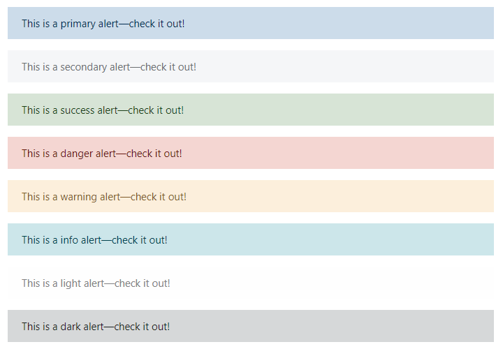
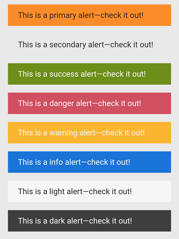
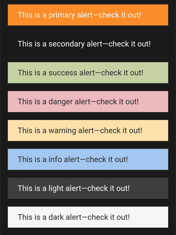

# Alert

### Bootstrap & Ionic

### Browser


### Moodle App Light/Dark Mode



``` HTML
<div class="alert alert-primary" role="alert">
    <ion-text color="dark">This is a primary alert—check it out!</ion-text>
</div>
<div class="alert alert-secondary" role="alert">
    <ion-text color="dark">This is a secondary alert—check it out!</ion-text>
</div>
<div class="alert alert-success" role="alert">
    <ion-text color="light">This is a success alert—check it out!</ion-text>
</div>
<div class="alert alert-danger" role="alert">
    <ion-text color="light">This is a danger alert—check it out!</ion-text>
</div>
<div class="alert alert-warning" role="alert">
    <ion-text color="light">This is a warning alert—check it out!</ion-text>
</div>
<div class="alert alert-info" role="alert">
    <ion-text color="light">This is a info alert—check it out!</ion-text>
</div>
<div class="alert alert-light" role="alert">
    <ion-text color="dark">This is a light alert—check it out!</ion-text>
</div>
<div class="alert alert-dark" role="alert">
    <ion-text color="light">This is a dark alert—check it out!</ion-text>
</div>
```

### Links
- https://getbootstrap.com/docs/4.6/components/alerts/
- https://ionicframework.com/docs/api/text
