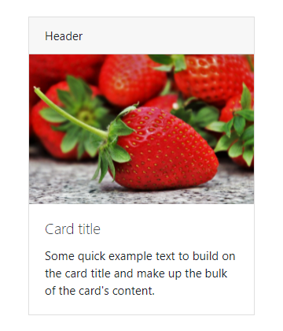
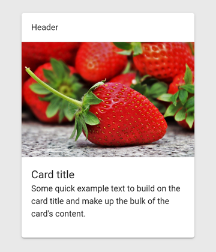
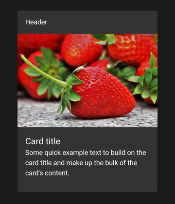
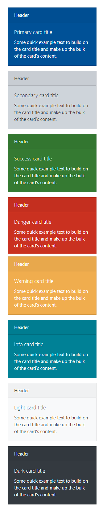
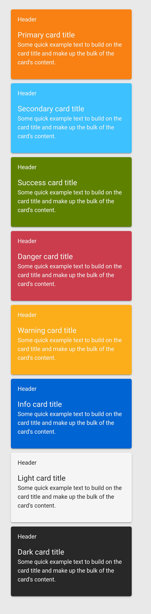
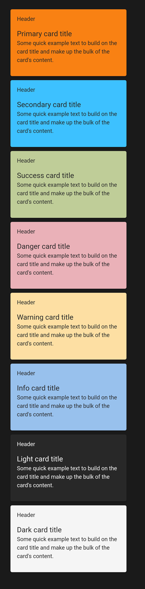

# Card

### Bootstrap & Ionic

## Card example

### Browser


### Moodle App Light/Dark Mode



``` HTML
<ion-card class="card mb-3" style="max-width: 18rem;">
    <ion-card-header class="card-header">Header</ion-card-header>
    
    <ion-card-content class="card-body">
        <h5 class="card-title">Card title</h5>
        <p class="card-text">Some quick example text to build on the card title and make up the bulk of the card's content.</p>
    </ion-card-content>
</ion-card>
```
## Card styles

### Browser


### Moodle App Light/Dark Mode



``` HTML
<ion-card color="primary" class="card text-white bg-primary mb-3" style="max-width: 18rem;">
    <ion-card-header class="card-header">
        <ion-text color="light">Header</ion-text>
    </ion-card-header>
    <ion-card-content class="card-body">
        <h5 class="card-title">
            <ion-text color="light">Primary card title</ion-text>
        </h5>
        <p class="card-text">
            <ion-text color="light">Some quick example text to build on the card title and make up the bulk of the card's content.</ion-text>
        </p>
    </ion-card-content>
</ion-card>
<ion-card color="secondary" class="card text-dark bg-secondary mb-3" style="max-width: 18rem;">
    <ion-card-header class="card-header">
        <ion-text color="light">Header</ion-text>
    </ion-card-header>
    <ion-card-content class="card-body">
        <h5 class="card-title">
            <ion-text color="light">Secondary card title</ion-text>
        </h5>
        <p class="card-text">
            <ion-text color="light">Some quick example text to build on the card title and make up the bulk of the card's content.</ion-text>
        </p>
    </ion-card-content>
</ion-card>
<ion-card color="success" class="card text-white bg-success mb-3" style="max-width: 18rem;">
    <ion-card-header class="card-header">
        <ion-text color="light">Header</ion-text>
    </ion-card-header>
    <ion-card-content class="card-body">
        <h5 class="card-title">
            <ion-text color="light">Success card title</ion-text>
        </h5>
        <p class="card-text">
            <ion-text color="light">Some quick example text to build on the card title and make up the bulk of the card's content.</ion-text>
        </p>
    </ion-card-content>
</ion-card>
<ion-card color="danger" class="card text-white bg-danger mb-3" style="max-width: 18rem;">
    <ion-card-header class="card-header">
        <ion-text color="light">Header</ion-text>
    </ion-card-header>
    <ion-card-content class="card-body">
        <h5 class="card-title">
            <ion-text color="light">Danger card title</ion-text>
        </h5>
        <p class="card-text">
            <ion-text color="light">Some quick example text to build on the card title and make up the bulk of the card's content.</ion-text>
        </p>
    </ion-card-content>
</ion-card>
<ion-card color="warning" class="card text-white bg-warning mb-3" style="max-width: 18rem;">
    <ion-card-header class="card-header">
        <ion-text color="light">Header</ion-text>
    </ion-card-header>
    <ion-card-content class="card-body">
        <h5 class="card-title">
            <ion-text color="light">Warning card title</ion-text>
        </h5>
        <p class="card-text">
            <ion-text color="light">Some quick example text to build on the card title and make up the bulk of the card's content.</ion-text>
        </p>
    </ion-card-content>
</ion-card>
<ion-card color="info" class="card text-white bg-info mb-3" style="max-width: 18rem;">
    <ion-card-header class="card-header">
        <ion-text color="light">Header</ion-text>
    </ion-card-header>
    <ion-card-content class="card-body">
        <h5 class="card-title">
            <ion-text color="light">Info card title</ion-text>
        </h5>
        <p class="card-text">
            <ion-text color="light">Some quick example text to build on the card title and make up the bulk of the card's content.</ion-text>
        </p>
    </ion-card-content>
</ion-card>
<ion-card color="light" class="card text-dark bg-light mb-3" style="max-width: 18rem;">
    <ion-card-header class="card-header">
        <ion-text color="dark">Header</ion-text>
    </ion-card-header>
    <ion-card-content class="card-body">
        <h5 class="card-title">
            <ion-text color="dark">Light card title</ion-text>
        </h5>
        <p class="card-text">
            <ion-text color="dark">Some quick example text to build on the card title and make up the bulk of the card's content.</ion-text>
        </p>
    </ion-card-content>
</ion-card>
<ion-card color="dark" class="card text-white bg-dark mb-3" style="max-width: 18rem;">
    <ion-card-header class="card-header">
        <ion-text color="light">Header</ion-text>
    </ion-card-header>
    <ion-card-content class="card-body">
        <h5 class="card-title">
            <ion-text color="light">Dark card title</ion-text>
        </h5>
        <p class="card-text">
            <ion-text color="light">Some quick example text to build on the card title and make up the bulk of the card's content.</ion-text>
        </p>
    </ion-card-content>
</ion-card>
```

### Links
- https://getbootstrap.com/docs/4.6/components/card/
- https://ionicframework.com/docs/api/card
