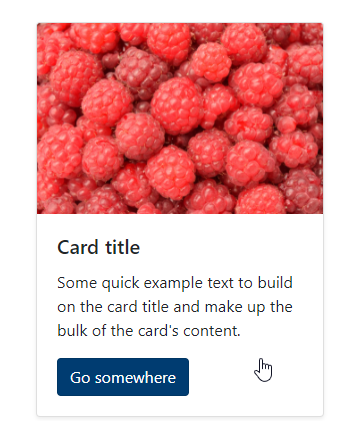

# Stretched link

### Bootstrap

### Browser


``` HTML
<div class="card shadow-sm m-1" style="width: 18rem;">
    
    <div class="card-body">
        <h5 class="card-title">Card title</h5>
        <p class="card-text">Some quick example text to build on the card title and make up the bulk of the card's content.</p>
        <a href="#" class="btn btn-primary stretched-link">Go somewhere</a>
    </div>
</div>
```

### Links
- https://getbootstrap.com/docs/4.6/utilities/stretched-link/
