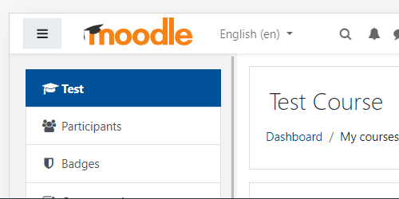
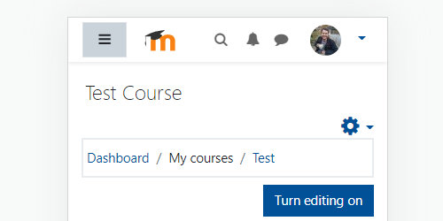

# Logo
It is not possible to upload svg files as logo in Moodle. But you can replace the logo text with a svg logo and also show an icon on small screens using CSS. Upload the files to a server or the Moodle home site and add the URLs of the files to the code below.

## Moodle 3.11

### Logo


### Icon


``` SCSS
// Hide logo text and uploaded logo.
.navbar .navbar-brand span.site-name,
.navbar .navbar-brand span.logo, {
    display: none !important;
}

// Add svg logo.
.navbar .navbar-brand::before {
    display: inline-block;
    background-image: url(.../logo.svg);
    background-size: 150px 35px;
    width: 150px;
    height: 35px;
    content: "";
}

@media screen and (max-width: 576px) {

    // Show logo.
    .navbar .navbar-brand {
        display: flex !important;
    }

    // Add svg icon.
    .navbar .navbar-brand::before {
        background-image: url(.../icon.svg);
        background-size: 35px 35px;
        width: 35px;
        height: 35px;
        content: "";
    }
}
```

## Moodle 4.0dev+

``` SCSS
// Hide logo text.
.navbar .navbar-brand {
    font-size: 0;
    color: transparent; // For safety, not needed.
}

// Hide uploaded logo.
.navbar span.logo {
    display: none !important;
}

// Add svg logo.
.navbar .navbar-brand::before {
    background-image: url(.../logo.svg);
    background-size: 150px 50px;
    width: 150px;
    height: 50px;
    content: "";
}

@media screen and (max-width: 576px) {

    // Show logo.
    .navbar .navbar-brand {
        display: flex !important;
    }

    // Add svg icon.
    .navbar .navbar-brand::before {
        background-image: url(.../icon.svg);
        background-size: 35px 35px;
        width: 35px;
        height: 35px;
        content: "";
    }
}
```
