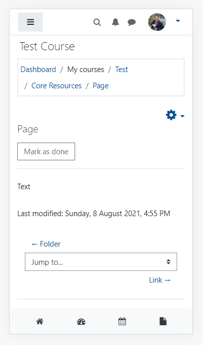

# Navbar bottom
Add this code to *Before BODY is closed additionalhtmlfooter* under *Site administration / Appearance / Additional HTML*.

The navbar shows up on medium and small devices.

Tested in Moodle 3.9, 3.10 and 3.11



```
<nav class="navbar navbar-light bg-light navbar-expand fixed-bottom d-lg-none">
    <ul class="navbar-nav w-100 justify-content-around">
        <li class="nav-item icon-no-margin"><a href="/?redirect=0" class="nav-link"><i class="icon fa fa-home text-dark"
                    aria-hidden="true" title="Site home"></i></a></li>
        <li class="nav-item icon-no-margin"><a href="/my/" class="nav-link text-dark"><i
                    class="icon fa fa-dashboard text-dark" aria-hidden="true" title="Dashboard"></i></a></li>
        <li class="nav-item icon-no-margin"><a href="/calendar/view.php?view=month" class="nav-link"><i
                    class="icon fa fa-calendar text-dark" aria-hidden="true" title="Calendar"></i></a></li>
        <li class="nav-item icon-no-margin"><a href="/user/files.php" class="nav-link text-dark"><i
                    class="icon fa fa-file text-dark" aria-hidden="true" title="Private files"></i></a></li>
    </ul>
</nav>
```